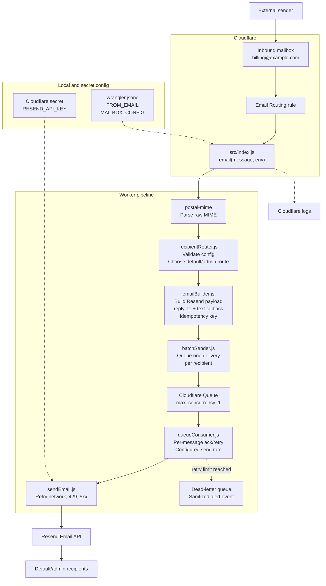
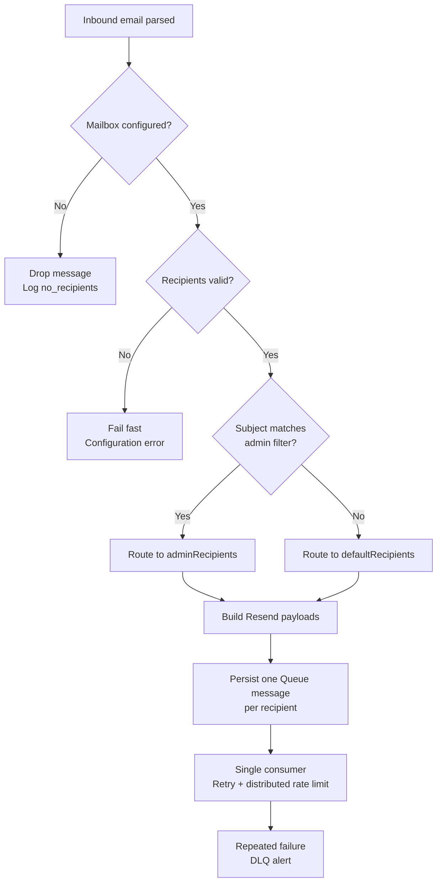

# Cloudflare Email Router

Serverless email forwarding worker built on Cloudflare Email Workers and Resend.

This project receives inbound email for one or more configured mailboxes, parses the raw message, chooses recipients from a JSON routing table, and queues one delivery per recipient. A single Cloudflare Queue consumer forwards messages through Resend with retry, distributed rate limiting, idempotency keys, dead-letter handling, sanitized structured logs, and unit-tested routing rules.

## What This Demonstrates

- Backend automation with Cloudflare Email Workers
- Serverless email processing using raw MIME parsing
- Configuration-driven routing and validation
- Cloudflare Queues integration with per-recipient retries, a dead-letter queue, and distributed rate limiting
- Resend API integration with retries and idempotency
- Unit-tested routing, payload building, HTML fallback behavior, and error handling
- Secure deployment practices with local-only Wrangler config and Cloudflare secrets

## Problem

Small teams often need lightweight mailbox automation without running a mail server or paying for a full helpdesk. A billing address, support address, or intake mailbox may need to forward routine email to one group while escalating specific subjects to an admin inbox.

This Worker solves that by making routing configuration-driven:

- Cloudflare receives the inbound email.
- The Worker parses the raw MIME message.
- The mailbox and subject determine the route.
- Resend sends the forwarded email from a verified sender.
- Replies go back to the original sender through `reply_to`.

Attachments are intentionally not forwarded in this project. The goal is reliable text/HTML forwarding and routing automation.

## Architecture



## Worker Flow

1. Cloudflare invokes the Worker through the `email(message, env)` handler in `src/index.js`.
2. `postal-mime` parses `message.raw` into a structured email object.
3. `recipientRouter` normalizes the destination mailbox and loads `MAILBOX_CONFIG`.
4. If the subject contains one of the mailbox's `adminSubjectFilters`, the message goes to `adminRecipients`.
5. Otherwise, it goes to `defaultRecipients`.
6. `emailBuilder` creates one Resend payload per recipient.
7. `enqueueEmailBatch` persists one independent Queue message per recipient.
8. The Queue consumer runs with concurrency `1`, spaces Resend requests using `RESEND_RATE_MAX_REQUESTS` and `RESEND_RATE_WINDOW_MS`, and acknowledges each successful recipient independently.
9. `sendWithRetry` retries network errors, HTTP `429`, and HTTP `5xx` responses with backoff.
10. A failed Queue message is retried with delay. After `max_retries`, Cloudflare moves it to the DLQ and the Worker emits the sanitized `alert.email.dead_letter` event.



## Resend Integration

The Queue consumer calls Resend's email API with `fetch`. The inbound Email Worker completes only after every recipient delivery has been persisted to Cloudflare Queues.

Each forwarded message includes:

- `from`: the verified sender configured by `FROM_EMAIL` and optional `FROM_NAME`
- `to`: one routed recipient
- `subject`: original subject, or `Sem assunto` when missing
- `text`: original plain text, generated text from HTML, or an empty-content fallback
- `html`: original HTML when present
- `reply_to`: original `Reply-To`, falling back to original `From`

Each request also includes:

- `Authorization: Bearer <RESEND_API_KEY>`
- `Idempotency-Key: fwd-<sha256>-<recipientIndex>`

Resend response bodies and raw network error messages are not re-thrown or written to logs. Failed calls log status, response body length, error type, and recipient domain only. Each Queue message is acknowledged or retried independently, so one successful recipient is never resent because another recipient failed. Root handler errors are reduced to the stable `EMAIL_PROCESSING_FAILED` code without raw messages or stacks.

## Requirements

- Node.js 22 or newer
- npm
- Cloudflare account with Email Routing enabled
- Cloudflare Email Routing rules connected to the Worker for each inbound mailbox
- Resend account and API key
- A Resend-verified sending domain for `FROM_EMAIL`
- A Cloudflare Queue and dead-letter queue
- A local `wrangler.jsonc` file

`wrangler.jsonc` is required for local development, verification, and deployment. It is intentionally ignored by Git because it contains project-specific mailbox addresses and deployment configuration. Use `wrangler.example.jsonc` as the public template.

## Setup

Install dependencies:

```bash
npm install
```

Create the required local Wrangler config:

```bash
cp wrangler.example.jsonc wrangler.jsonc
```

Edit `wrangler.jsonc` with your Worker name, sender address, and mailbox routing table.

Create the Queue resources using the names configured in `wrangler.jsonc`:

```bash
npx wrangler queues create email-router-send
npx wrangler queues create email-router-dlq
```

Add the Resend API key as a Cloudflare secret:

```bash
npx wrangler secret put RESEND_API_KEY
```

Configure a Cloudflare log alert or notification for the structured event
`alert.email.dead_letter`. The DLQ consumer emits this event with sanitized
mailbox, route, recipient-domain, attempt-count, and Queue-message metadata.

## Configuration

`MAILBOX_CONFIG` is keyed by mailbox profile name or email address. Each mailbox needs a routed address and at least one default recipient. `FROM_EMAIL` must be a valid bare email address from a Resend-verified domain; use `FROM_NAME` for the display name. `RESEND_RATE_MAX_REQUESTS` and `RESEND_RATE_WINDOW_MS` control the globally serialized Queue consumer rate. Keep the Queue consumer's `max_batch_size` at or below the configured request count.

Example:

```jsonc
{
  "vars": {
    "FROM_NAME": "Example notifications",
    "FROM_EMAIL": "noreply@example.com",
    "RESEND_RATE_MAX_REQUESTS": 5,
    "RESEND_RATE_WINDOW_MS": 3000,
    "EMAIL_DLQ_NAME": "email-router-dlq",
    "MAILBOX_CONFIG": {
      "billing": {
        "address": "billing@example.com",
        "defaultRecipients": ["billing-team@example.com"],
        "adminRecipients": ["billing-admin@example.com"],
        "adminSubjectFilters": ["payment failed", "update required"]
      },
      "support": {
        "address": "support@example.com",
        "defaultRecipients": ["support-team@example.com"],
        "adminRecipients": ["support-admin@example.com"],
        "adminSubjectFilters": []
      }
    }
  }
}
```

Routing behavior:

- Subjects matching `adminSubjectFilters` go to `adminRecipients`.
- Non-matching subjects go to `defaultRecipients`.
- Empty or missing `adminSubjectFilters` means the mailbox always uses `defaultRecipients`.
- Invalid mailbox addresses or recipient emails fail fast during routing.
- Recipient lists support arrays and comma-separated strings, including quoted display names such as `"Doe, John" <john@example.com>`.
- `FROM_EMAIL` is validated before any Resend call is made.
- Queue payloads are limited by Cloudflare's 128 KB per-message limit.

## Commands

Run the Worker locally:

```bash
npm run dev
```

Run syntax checks:

```bash
npm run check:syntax
```

Run unit tests:

```bash
npm test
```

Run the full local verification path:

```bash
npm run verify
```

`npm run verify` requires a valid local `wrangler.jsonc` because it performs a Wrangler dry-run deployment.

Deploy:

```bash
npm run deploy
```

## Tests

The test suite uses Node's built-in test runner.

Covered behavior includes:

- Recipient list parsing
- Display-name email extraction
- Quoted display names containing commas
- Invalid recipient and mailbox validation
- Invalid sender validation
- Subject-based admin routing
- Default routing fallback
- Stable idempotency keys
- One payload per recipient
- `reply_to` preservation
- HTML-to-text entity decoding and script/style/comment stripping
- Sanitized Resend HTTP and network errors
- End-to-end inbound parsing, routing, payload building, and Queue persistence
- Root-error sanitization without raw messages or stack traces
- Per-recipient Queue acknowledgement and retry
- Dead-letter alert logging
- HTTP `429` and `5xx` retry behavior

## Security Notes

- Do not commit `wrangler.jsonc`.
- Do not commit `.dev.vars`, `.env`, API keys, production mailbox addresses, or real recipient lists.
- Keep `RESEND_API_KEY` in Cloudflare secrets.
- Use a Resend-verified sender domain for `FROM_EMAIL`.
- Logs avoid full recipient addresses where practical and focus on route, mailbox, message size, sender domain, recipient domain, and counts.
- Resend response bodies and raw network exception messages are not logged or included in thrown errors.
- Root processing errors use a stable code and do not log raw messages or stack traces.
- The Worker validates configured mailbox, recipient, and sender addresses before forwarding.
- Attachments are not forwarded by design.

## Project Structure

```text
src/index.js                    Cloudflare Email Worker entrypoint
src/handlers/sendEmail.js        Resend API call, retry, backoff
src/handlers/batchSender.js      One persistent Queue message per recipient
src/handlers/queueConsumer.js    Queue ack/retry, DLQ alert handling
src/utils/recipientRouter.js     Mailbox config parsing and routing
src/utils/emailBuilder.js        Resend payload and idempotency key builder
src/utils/htmlToText.js          HTML fallback text conversion
src/utils/rateLimiter.js         Configurable serialized Resend request pacing
tests/                          Node test suite
wrangler.example.jsonc          Public config template
wrangler.jsonc                  Required local config, ignored by Git
```
